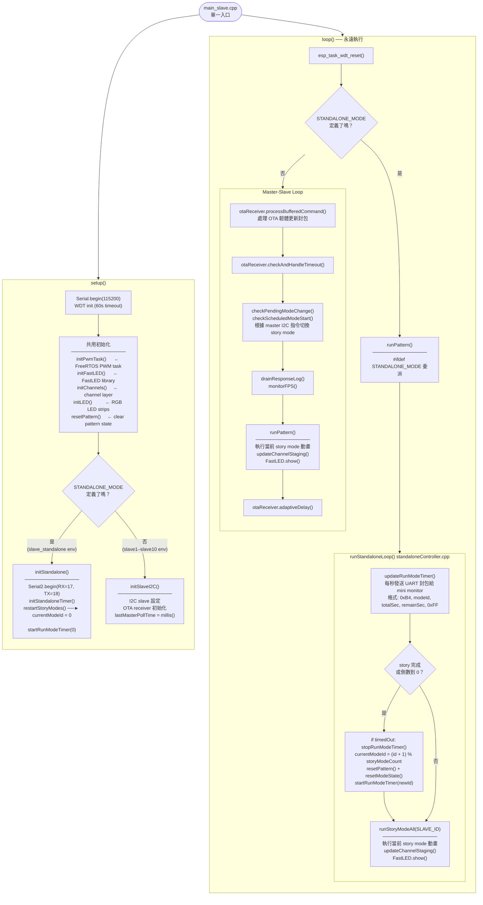

# Slave 韌體路由指南

> 講解 slave 晶片開機後做咩、行緊咩、兩種模式有咩分別。
> 同 [`README.md`](../../../README.md)、[`motor_servo.md`](../../motor/motor_servo.md) 一齊睇效果最好。

---

## 一個 slave 入口，兩條路線

`firmware/slave/src/main_slave.cpp` 係 slave 唯一嘅入口。
**編譯時** 根據有冇 `-D STANDALONE_MODE=1` 旗標，分成兩條完全唔同嘅運行路線：

| 模式 | 編譯旗標 | 用喺邊 | 需要 master？ |
|---|---|---|---|
| **Master-Slave** | 無 | `slave1`–`slave10` env | ✅ 要 |
| **Standalone** | `-D STANDALONE_MODE=1` | `slave_standalone` env | ❌ 唔需要 |

> 兩條路線**唔會同時行**——係 build 嘅時候已經決定咗。

## 目前 Slave ID 與 I2C 地址

Master 目前使用 `ACTUAL_SLAVE_NUM=20`。I2C 從 `0x10` 開始連續排列到 Slave 20 的 `0x23`；Slave 19／20 是左右腳掌，使用 `0x22`／`0x23`。

| Slave | PlatformIO env | I2C 地址 | 本專案身份 |
| --- | --- | --- | --- |
| 1 | `slave1` | `0x10` | platform |
| 2 | `slave2` | `0x11` | backpack |
| 3 | `slave3` | `0x12` | chest |
| 4 | `slave4` | `0x13` | paired body L |
| 5 | `slave5` | `0x14` | paired body R |
| 6 | `slave6` | `0x15` | waist / independent body |
| 7 | `slave7` | `0x16` | left leg |
| 8 | `slave8` | `0x17` | right leg |
| 9 | `slave9` | `0x18` | platform |
| 10 | `slave10` | `0x19` | **Foulyoupou platform（新增）** |

`platformio_local.ini` 內 Slave 10 已啟用 RGB1–12 相關數量、7 塊 LED PCA9685 與 6 路 ESP motor；story mode 分派詳見 `docs/storymode/storymode目錄.md`。

---

## 大白話：slave 開機後做咩？

### 共用步驟（兩種模式都會行）

開機 → setup() 做以下嘢：

1. **Serial.begin** — 開 log
2. **WDT** — 開 watchdog（60 秒冇反應就自動 reboot）
3. **initPwmTask** — 起一個背景 task 專門出 PWM 訊號
4. **initFastLED / initChannels / initLED** — RGB 燈、馬達、單色燈通道全部準備好
5. **resetPattern** — 清空畫面

### 之後就分叉了

#### 🟦 Master-Slave 模式

1. **initSlaveTransport** — 現有 env 由 `SLAVE_TRANSPORT_UART` 選 I2C 或 GPIO14/15/16 RS485
2. **OTA receiver** — 準備接收 master 過嚟嘅韌體更新
3. **等 master**
   - 收到 master 指令 → 行 master 指定嘅 story mode
   - I2C／RS485：超過 **10 秒**仍未認到 Master → 自動進入 `storyMode_dev`
   - 進入前先對 GPIO17 DC motor 發 STOP；認回 Master 後退出 DEV，等待新的 Mode 指令

#### 🟩 Standalone 模式

1. **Serial2.begin** — 開 UART，準備出倒數計時去 mini monitor
2. **initStandaloneTimer** — timer 起動
3. **restartStoryModes** — `currentModeId = 0`，由第一個 story mode 開始
4. **自動循環** — story mode 0 行完 → 1 → 2 → 3 → 0 …，永遠唔停

---

## 路由圖（技術詳細）



---

## 兩種模式對比

| | Standalone | Master-Slave |
|---|---|---|
| **PlatformIO env** | `slave_standalone` | `slave1`–`slave20` |
| **編譯旗標** | `-D STANDALONE_MODE=1` | 無 |
| **需要 master？** | 否 | 是 |
| **Story mode 控制** | 自動循環（0→1→2→3→0） | Master 透過 I2C 或 RS485 middleware 指定 |
| **UART 用途** | 倒數送去 mini monitor（TX=18） | Timer／Video UART；Master↔Slave 可選 GPIO15/14 RS485 middleware |
| **OTA 更新** | USB 燒錄（無 WiFi） | 透過 master WiFi OTA |
| **Timer 控制** | `standaloneTimerController.cpp` | `master/timerController.cpp` |
| **斷線處理** | 不適用 | 10 秒仍未認到 Master → `storyMode_dev`；Slave 19／20 會執行已確認的 UART motor Dev 測試循環，其餘 GPIO17 motor 保持 STOP |

---

## 共用層（兩種模式都會行）

| 元件 | 檔案 | 做咩 |
|---|---|---|
| FreeRTOS PWM task | `shared/src/pwm/pwmTask.cpp` | 背景跑 PCA9685 I2C 派送 |
| Channel layer | `shared/src/lib/lib_channel.cpp` | LED / 馬達通道統一管理 |
| Story mode controller | `shared/src/storymode/storyModeController.cpp` | `runStoryModeAll()` 跑動畫 |
| FastLED | 第三方 library | RGB 燈輸出 |
| Logger | `shared/include/logger.h` | Serial debug log |

---

## 點樣分自己係邊種模式？

睇 `platformio_local.ini` 用咗邊個 env：

```bash
# Master-Slave
pio run -e slave1 -t upload

# Standalone
pio run -e slave_standalone -t upload
```

或者開 serial monitor 睇 boot log：
- 見到「等待 master 呼叫... X/10 seconds」→ **Master-Slave**
- 見到「Standalone」、「Serial2 RX/TX」之類 → **Standalone**

---

## 常見情況

### 🔴 「等待 master 呼叫...」一直印，無入 master-slave 流程

`master` 同 `slave` I2C 接駁有問題。檢查：
- Master GPIO 15 (SDA) ↔ Slave GPIO 7 (SDA)
- Master GPIO 14 (SCL) ↔ Slave GPIO 8 (SCL)
- 兩邊共用 GND
- SDA / SCL 各自接 4.7kΩ pull-up 去 3.3V

### 🔵 入咗 `storyMode_dev`

代表 Slave 連續 10 秒仍未認到 Master。Dev RGB／ESP 單色燈會開始運行；Slave 19／20
會循環執行 UART motor A 10 秒、STOP 3 秒、B 10 秒、STOP 3 秒，其餘 Slave motor 保持
STOP。Master 返回時先立即送 motor STOP，再退出 Dev Mode並等待新的 Mode 指令。

### 🟢 想單獨測試一塊 slave 嘅燈效，唔想開 master

用 `slave_standalone` env，自動循環播放所有 story mode。

### 🟢 Standalone 本機 WiFi

`slave_standalone` 只保留本機 AP，不再連 router，也沒有 WiFi manager：

- AP 名稱：`Penelope-Standalone`
- 密碼：`12345678`
- 完整控制頁：`http://192.168.4.1/app`
- `http://192.168.4.1/colorpicker.html` 是建議完整 app 手動入口；`/`、`/app`、`/colorpicker` 會送完整 app；`/wifi`、`/setup` 會 redirect 到 `/app`；手機/電腦 captive portal 偵測網址會 redirect 到 `/app`

---

## 檔案對應

```
firmware/slave/src/
├── main_slave.cpp                  ← 單一入口
├── standaloneController.cpp        ← Standalone loop
├── standaloneTimerController.cpp   ← UART 倒數計時
├── i2cController.cpp               ← Master-Slave I2C 接收
└── otaReceiver.cpp                 ← OTA 韌體更新

firmware/shared/src/
├── storymode/storyModeController.cpp  ← runStoryModeAll()（共用）
├── ledController.cpp                  ← initFastLED / runPattern（共用）
├── pwm/pwmTask.cpp                        ← FreeRTOS PWM task（共用）
└── lib/lib_channel.cpp                ← 通道層（共用）
```

---

## 相關文件

- [`README.md`](../../../README.md) — 整體設定 checklist
- [`docs/colorpicker/color_picker.md`](../../colorpicker/color_picker.md) — standalone ColorPicker / 本機 AP / VU 測試
- [`docs/motor/motor_servo.md`](../../motor/motor_servo.md) — 可動馬達 API
- [`docs/communication/master_slave/協議規格_slaveUART.md`](協議規格_slaveUART.md) — Master↔Slave RS485 middleware
